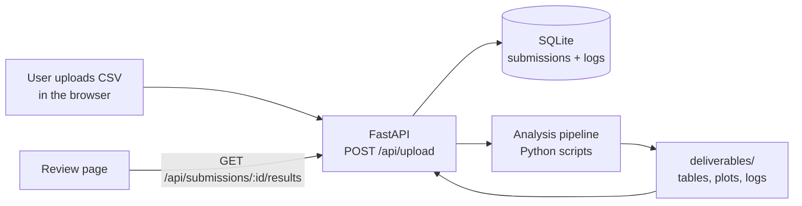

# Rayfield Systems: Emissions Anomaly Dashboard

A full-stack web app for analyzing facility greenhouse-gas emissions data. Upload a CSV, and the app cleans the data, trains machine-learning models on it, flags unusual readings, and presents the results as a dashboard with charts, plain-English summaries, and downloadable reports.

Built as a project for Rayfield Systems. It's set up as a demo, not as production software. See [Limitations](#limitations).

---

## Contents

- [What it does](#what-it-does)
- [How it works](#how-it-works)
- [Tech stack](#tech-stack)
- [Project structure](#project-structure)
- [Getting started](#getting-started)
- [Configuration](#configuration)
- [Input data format](#input-data-format)
- [Using the app](#using-the-app)
- [API reference](#api-reference)
- [Running the pipeline without the UI](#running-the-pipeline-without-the-ui)
- [Deployment](#deployment)
- [Troubleshooting](#troubleshooting)
- [Limitations](#limitations)
- [Further documentation](#further-documentation)

---

## What it does

- **CSV upload and validation:** Accepts one or more emissions CSVs and checks that the required columns are present.
- **Automated analysis pipeline:** Cleans the data, engineers features, and fits regression models to predict expected CO₂ emissions.
- **Anomaly detection:** Uses an Isolation Forest to flag records that differ significantly from the rest. You can tune its sensitivity per upload.
- **AI-written summaries:** Generates a short compliance-style summary of the findings with OpenAI. If no API key is set, it falls back to a template summary.
- **Charts and reports:** Produces emissions-over-time, by-industry, and forecast-vs-actual plots, plus CSV and Excel reports you can download.
- **Upload history:** Keeps every submission and its results so you can go back to them later.

## How it works



1. The React frontend sends the CSV and form details to the FastAPI backend.
2. The backend saves the file as `uploads/<submission_id>_<filename>`, records the submission in SQLite, and checks that the required columns are there.
3. The backend runs the pipeline scripts in order. Each one runs as a separate process and receives `SUBMISSION_ID`, `SUBMISSION_CSV`, and `ANOMALY_THRESHOLD` as environment variables:

   | Step | Script | What it does |
   |---|---|---|
   | 1 | `csvclean.py` | Cleans the raw data and draws exploratory plots (CO₂ over time, by industry, by year) |
   | 2 | `main_pipeline.py` | Adds features, trains a regression model, runs Isolation Forest anomaly detection, and writes the main results table |
   | 3 | `yearly_regression.py` | Fits a linear regression on yearly averages and plots forecast vs. actual |
   | 4 | `yearly_anomaly_alerts.py` | Flags anomalous years and writes an alerts table and a text summary |
   | 5 | `excel_emissions_report.py` | Builds an Excel report with breakdowns by facility, quarter, and fuel, plus a GPT summary |

4. Every output file includes the submission ID in its name (for example `final_output_with_anomalies_42.csv`), so uploads never overwrite each other.
5. The Review page fetches `/api/submissions/<id>/results`, which collects the metrics, chart data, flagged anomalies, and summary for that submission.

## Tech stack

| Layer | Technologies |
|---|---|
| Frontend | React 18, TypeScript, Vite, Tailwind CSS, shadcn/ui (Radix), Wouter (routing), TanStack Query, Chart.js / Recharts |
| Frontend server | Express. Serves the React app in development (with Vite) and production. |
| Backend API | Python, FastAPI, Uvicorn |
| Data and ML | pandas, NumPy, scikit-learn (Linear Regression, Decision Tree, Isolation Forest), matplotlib |
| AI summaries | OpenAI API (`gpt-4.1-nano`) |
| Database | SQLite (`rayfield.db`, created automatically) |
| Reports | openpyxl / XlsxWriter |

## Project structure

```
rayfield/
├── backend/                       # FastAPI API + analysis pipeline
│   ├── main.py                    # API entry point (all endpoints live here)
│   ├── main_pipeline.py           # Core pipeline: features → regression → anomalies
│   ├── ai_module.py               # Shared ML + GPT helper functions
│   ├── chatgpt_summary.py         # OpenAI summary generator (with mock fallback)
│   ├── csvclean.py                # Data cleaning + exploratory plots
│   ├── yearly_regression.py       # Yearly linear regression
│   ├── yearly_anomaly_alerts.py   # Yearly anomaly alerts
│   ├── yearly_decision_tree.py    # Decision tree model (standalone)
│   ├── excel_emissions_report.py  # Excel report generation
│   ├── summary_generator.py       # Template-based report text
│   ├── emissions_by_unit.csv      # Sample dataset
│   ├── deliverables/              # Generated output (tables/, plots/, logs/)
│   ├── requirements.txt
│   ├── .env.example
│   └── render.yaml                # Render deployment blueprint
├── frontend/                      # React app + Express server
│   ├── client/src/
│   │   ├── pages/                 # One file per screen (Dashboard, Review, …)
│   │   ├── components/ui/         # shadcn/ui components
│   │   └── lib/api.ts             # API client (reads VITE_API_URL)
│   ├── server/                    # Express server that serves the client
│   ├── vite.config.ts
│   └── package.json
├── reference_docs/                # Weekly project deliverables (PDF/DOCX)
├── PROJECT_README.md              # In-depth technical reference
├── DEPLOYMENT.md                  # Render deployment walkthrough
└── IMPLEMENTATION_GUIDE.md        # Feature/workflow implementation notes
```

## Getting started

### Prerequisites

- **Python** 3.11 (3.8+ should work)
- **Node.js** 18 or newer, with npm
- An **OpenAI API key** (optional; without one you get template summaries)

### 1. Clone the repository

```bash
git clone https://github.com/JaspreetSinghA/rayfield.git
cd rayfield
```

### 2. Start the backend

Run the backend from inside `backend/`. The scripts use paths relative to that folder.

```bash
cd backend
python3 -m venv venv
source venv/bin/activate          # Windows: venv\Scripts\activate
pip install -r requirements.txt

cp .env.example .env              # then add your OpenAI key (optional)

uvicorn main:app --reload --port 8000
```

Check that it's running by opening <http://localhost:8000>. You should see a JSON response containing `"Rayfield Systems API is running"`. Interactive API docs are at <http://localhost:8000/docs>.

### 3. Start the frontend

In a second terminal:

```bash
cd frontend
npm install
PORT=5001 npm run dev
```

Open <http://localhost:5001>.

> **Why port 5001?** The Express server defaults to port 5000, but on macOS that port is used by AirPlay Receiver. Any free port works.

The frontend calls `http://localhost:8000` by default, so local development needs no extra configuration.

### 4. Try it out

1. Sign in with the built-in demo account **`admin@rayfield.com`**. The password isn't checked (see [Limitations](#limitations)).
2. Go to **Upload Submission** and upload `backend/emissions_by_unit.csv`, or any CSV in the [expected format](#input-data-format).
3. When processing finishes, open the results on the **Review** page.

## Configuration

### Backend (`backend/.env`)

| Variable | Required | Default | Purpose |
|---|---|---|---|
| `OPEN_AI_KEY` | No | none | Enables GPT-written summaries. If it's missing, the app uses template text. |
| `FRONTEND_URL` | No | `*` | Origin allowed by CORS. Set it to your frontend's URL in production. |
| `PORT` | No | `8000` | Port used when running `python main.py` directly. |

> Note: `ai_module.py` (used by the Excel report step) reads `OPENAI_API_KEY` instead. To get GPT text in every part of the app, set both variables to the same key.

### Frontend

| Variable | Default | Purpose |
|---|---|---|
| `VITE_API_URL` | `http://localhost:8000` | Backend base URL. Vite reads it at build time, so set it before running `npm run build`. |
| `PORT` | `5000` | Port for the Express server. |

For local overrides, put `VITE_API_URL` in `frontend/client/.env`. See `frontend/env.example` for a template.

## Input data format

Uploads must be **CSV** files with at least these two columns. Leading and trailing spaces in column names are ignored.

| Column | Example |
|---|---|
| `Reporting Year` | `2024` |
| `Unit CO2 emissions (non-biogenic)` | `1500.5` |

Extra columns are used when they're present, for example `Facility Name`, `Industry Type (sectors)`, `Unit Type`, `Unit Methane (CH4) emissions`, and `Unit Nitrous Oxide (N2O) emissions`. The included sample file `backend/emissions_by_unit.csv` (~250k rows of unit-level facility emissions) shows the full format.

A minimal valid file:

```csv
Facility Name,Reporting Year,Unit CO2 emissions (non-biogenic)
Power Plant Alpha,2022,1420.0
Power Plant Alpha,2023,1475.2
Power Plant Alpha,2024,1500.5
```

## Using the app

| Page | Route | Purpose |
|---|---|---|
| Home | `/` | Landing page |
| Sign in / Sign up | `/signin`, `/signup` | Demo authentication |
| Dashboard | `/dashboard` | Hub linking to every feature |
| Upload Submission | `/upload-submission` | Upload CSVs, set a title, category, and anomaly threshold |
| Review | `/review` | Results for one submission: metrics, charts, anomalies, summary |
| Upload History | `/upload-history` | Every past submission, with links to its results |
| Upload Log | `/upload-log` | Raw log of uploads and the thresholds used |
| Flagged Anomalies | `/flagged-anomalies` | Browse anomalies, filter them, and update their status |
| Export Reports | `/export-reports` | Download generated CSV, Excel, and plot files |
| Profile / Get Help | `/profile`, `/get-help` | Account info and help |

### Anomaly threshold

The upload form has an **anomaly threshold** setting that controls how sensitive detection is (the Isolation Forest `contamination` parameter):

- `auto`: the model chooses the cutoff.
- A number such as `5`: flag roughly the most unusual 5% of records. Values below 1 are read as fractions, so `0.05` gives the same result. Isolation Forest can't flag more than half the data, so stay at or below `50` (or `0.5`).

If no records are flagged, try a higher value. If almost everything is flagged, try a lower one.

## API reference

All endpoints are defined in [`backend/main.py`](backend/main.py). Full request and response schemas are in the auto-generated docs at `/docs` while the backend is running.

<details>
<summary><strong>Show all endpoints</strong></summary>

**Health**

| Method | Endpoint | Description |
|---|---|---|
| GET | `/` | Health check |

**Auth (demo)**

| Method | Endpoint | Description |
|---|---|---|
| POST | `/api/auth/login` | Log in (returns a mock token) |
| POST | `/api/auth/register` | Create a user |
| POST | `/api/auth/logout` | Log out |
| GET | `/api/user/profile` | Current user |

**Uploads and results**

| Method | Endpoint | Description |
|---|---|---|
| POST | `/api/upload` | Upload CSV(s) and run the full pipeline |
| POST | `/api/upload/text` | Submit text instead of a file |
| GET | `/api/submissions/history` | List past submissions |
| GET | `/api/submissions/{id}/results` | Analysis results for one submission |
| GET | `/api/upload/logs` | Upload log entries |

**Anomalies**

| Method | Endpoint | Description |
|---|---|---|
| GET | `/api/anomalies` | List anomalies |
| GET | `/api/anomalies/{id}` | Get one anomaly |
| PUT | `/api/anomalies/{id}/status` | Update status (Active, Under Review, Resolved) |
| GET / POST | `/api/thresholds/{submission_id}` | Read or set a submission's threshold |
| GET / POST | `/api/anomaly-feedback/{submission_id}/{anomaly_id}` | Read or leave feedback on an anomaly |

**Reports and files**

| Method | Endpoint | Description |
|---|---|---|
| GET | `/api/reports/list` | List generated tables, plots, and logs |
| GET | `/api/reports/download/{type}/{filename}` | Download a generated file |
| POST | `/api/reports/system` | System report |
| POST | `/api/reports/analytics` | Analytics report |
| POST | `/api/reports/compliance` | Compliance report |
| GET | `/static/{path}` | Serve generated files such as plot images |

**Utilities**

| Method | Endpoint | Description |
|---|---|---|
| POST | `/api/process-energy-data` | Run analysis on an already-uploaded file |
| POST | `/api/upload/test` | Test upload endpoint |
| POST | `/api/chatgpt/test` | Check that the OpenAI integration works |

</details>

## Running the pipeline without the UI

You can run any pipeline script directly, which helps when debugging. From `backend/`:

```bash
SUBMISSION_ID=test1 \
SUBMISSION_CSV=emissions_by_unit.csv \
ANOMALY_THRESHOLD=auto \
python main_pipeline.py
```

Output goes to `backend/deliverables/`:

| Folder | Contents |
|---|---|
| `tables/` | `cleaned_emissions_by_unit_<id>.csv`, `features_<id>.csv`, `final_output_with_anomalies_<id>.csv`, `alerts_today_<id>.csv`, … |
| `plots/` | `co2_emissions_over_time_<id>.png`, `co2_emissions_by_industry_<id>.png`, `yearly_forecast_vs_actual_<id>.png`, … |
| `logs/` | `weekly_summary_<id>.txt` and other summaries |

## Deployment

The backend and frontend are deployed as two separate services.

**Backend**

- Build: `pip install -r requirements.txt`
- Start: `uvicorn main:app --host 0.0.0.0 --port $PORT`
- Set `OPEN_AI_KEY`, and set `FRONTEND_URL` to the deployed frontend's URL.

**Frontend**

- Build: `npm install && npm run build`. Set `VITE_API_URL` to the deployed backend URL first.
- Start: `npm start`, which serves the built app with Express on `$PORT`.

A ready-made Render blueprint is in [`backend/render.yaml`](backend/render.yaml), with a step-by-step guide in [DEPLOYMENT.md](DEPLOYMENT.md). The same build and start commands also work on Railway.

> SQLite and the `uploads/` and `deliverables/` folders live on the server's local disk. On most free hosting tiers that disk is wiped on every redeploy, so uploaded data won't persist between deploys.

## Troubleshooting

| Problem | What to check |
|---|---|
| Upload fails with "Missing columns" | The CSV needs `Reporting Year` and `Unit CO2 emissions (non-biogenic)`. See [Input data format](#input-data-format). |
| Upload fails with "Pipeline failed at `<script>`" | The full error is in the upload response and in the backend terminal. Running that script by itself ([see above](#running-the-pipeline-without-the-ui)) usually makes the cause clear. |
| Frontend can't reach the backend | Make sure the backend is running on port 8000 and `VITE_API_URL` is correct. In production, check that `FRONTEND_URL` matches the frontend origin (CORS). |
| `EADDRINUSE` / port 5000 already in use | Start the frontend on another port: `PORT=5001 npm run dev`. |
| Summaries start with `[MOCK SUMMARY]` | No OpenAI key was found. Set `OPEN_AI_KEY` in `backend/.env` and restart the backend. |
| Results page is empty | Check that files with the submission ID exist in `backend/deliverables/tables/` and `logs/`. |
| No anomalies, or everything flagged | Adjust the anomaly threshold (see [Anomaly threshold](#anomaly-threshold)). |

## Limitations

This project is built for demos and learning. Before relying on it for anything real, keep these in mind:

- **Authentication is mocked.** Passwords aren't verified and every login gets the same placeholder token. Don't deploy it with real user data.
- **Processing is synchronous.** The upload request waits until the whole pipeline finishes, so large files can take a while.
- **Single-server storage.** SQLite and the generated files live on one machine's disk. There's no multi-user isolation or durable storage.
- **AI output needs review.** GPT summaries can be wrong and should be checked before you use them in compliance work.

## Further documentation

- [PROJECT_README.md](PROJECT_README.md): in-depth technical reference covering data flow, file naming, pipeline internals, and debugging tips
- [DEPLOYMENT.md](DEPLOYMENT.md): deploying to Render step by step
- [IMPLEMENTATION_GUIDE.md](IMPLEMENTATION_GUIDE.md): how each feature and workflow step was built
- [backend/README.md](backend/README.md): notes on the standalone analysis scripts
- [reference_docs/](reference_docs/): weekly project deliverables
